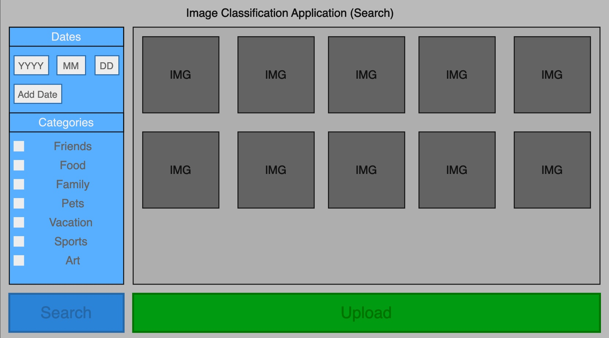
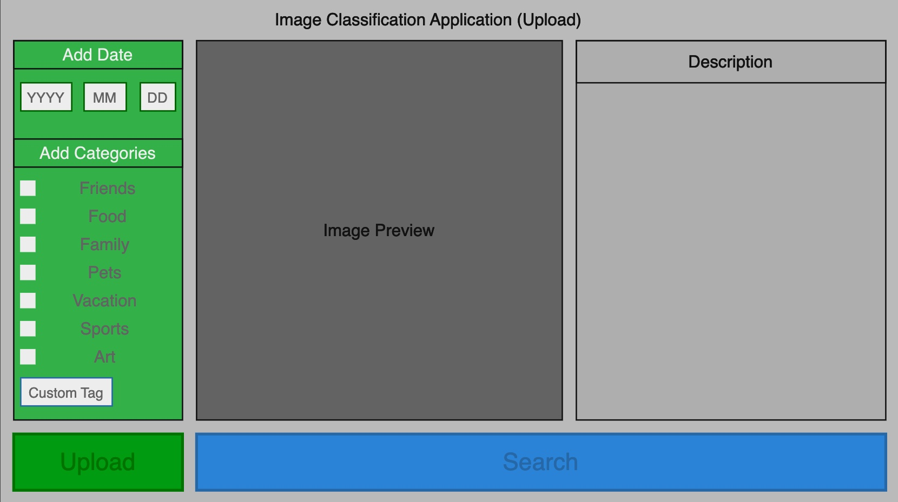

# Image Classification Application

## Description:
This application will handle the searching and uploading of images, providing the user with an intuitive GUI for both functions. The search page will display the images in the dataset in the order they were added by default. Searches can be refined by typing dates or setting categorically appropriate tags. The user can click on the search results to see more 
detailed information about the image that can be edited. The user can also upload their images to the dataset by setting categories, descriptions, tags, etc.

## GUI mock-up

## Objectives:
* Develop an intuitive GUI with an easy-to-use experience.
* Ensure support for multiple users, with data security between them.
* Handle the efficient searching of images in the dataset.
* Provide image uploading functionality for each user.
* Scaleability for more users and larger datasets.
* Optimize the performance of the search on larger datasets.

## Features:
* Multiple user accounts.
* The searching of images in the user's account or the public image set.
* The uploading of images to the user account or the public image set.
* Customizable search parameters.
* Entries will be editable by the user.

## Weekly updates

### Week 1:
* Created the GitHub repo for this project
* Finished the project proposal
* Made mock-up GUI images
* Finishing up the CRC cards
### Week 2:
### Week 3:
### Week 4:
### Week 5:
### Week 6:
### Week 7:
### Week 8:
