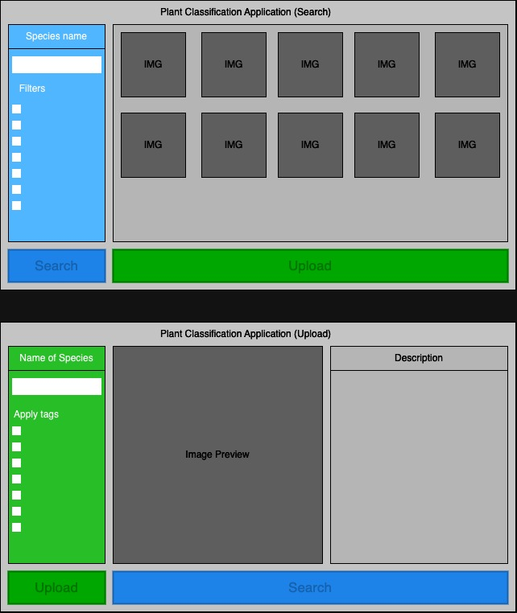

# PlantClassificationApp

## Description:
This application will display a GUI to the user. The GUI will have two pages, one for searching and the other for uploading entries. On the search page, the user will see a search bar, multiple filter buttons, a preview of the returned images, a search button, and an upload button. The user can type the name of the plant they want to search for in the search bar. If the user only provides the name of the species, then the program will return all entries under that name. The user will also see the filter tags, these tags can be set so that the user can search the dataset for entries with the associated tags. Once the user clicks the search button the program will return entries with the specified search parameters. Otherwise, the name and tags can be used in conjunction for more refined searching. The results of the search will be displayed on this page for the user to browse through.

On the upload page, the user can provide their image to be added to the dataset. The user will have to specify a name for the entry along with any relevant tags. At this point, the user can also choose to provide a description of their image. Clicking the upload button will add the entry to the dataset.

## GUI mockup

